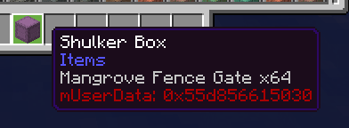
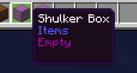

# CorvidShulker

## Overview
**CorvidShulker** is an early-stage Shulker Preview mod. It’s very much a work-in-progress, as of now it does the following:

- Displays a tooltip indicating whether a Shulker Box is empty.
- Prints the raw `mUserData` pointer.

## Screenies

### With mUserData

### Without mUserData

## Current Status
- Hover preview of Shulker contents is not fully implemented.

## Future Goals
- Show actual item previews inside the Shulker Box.

